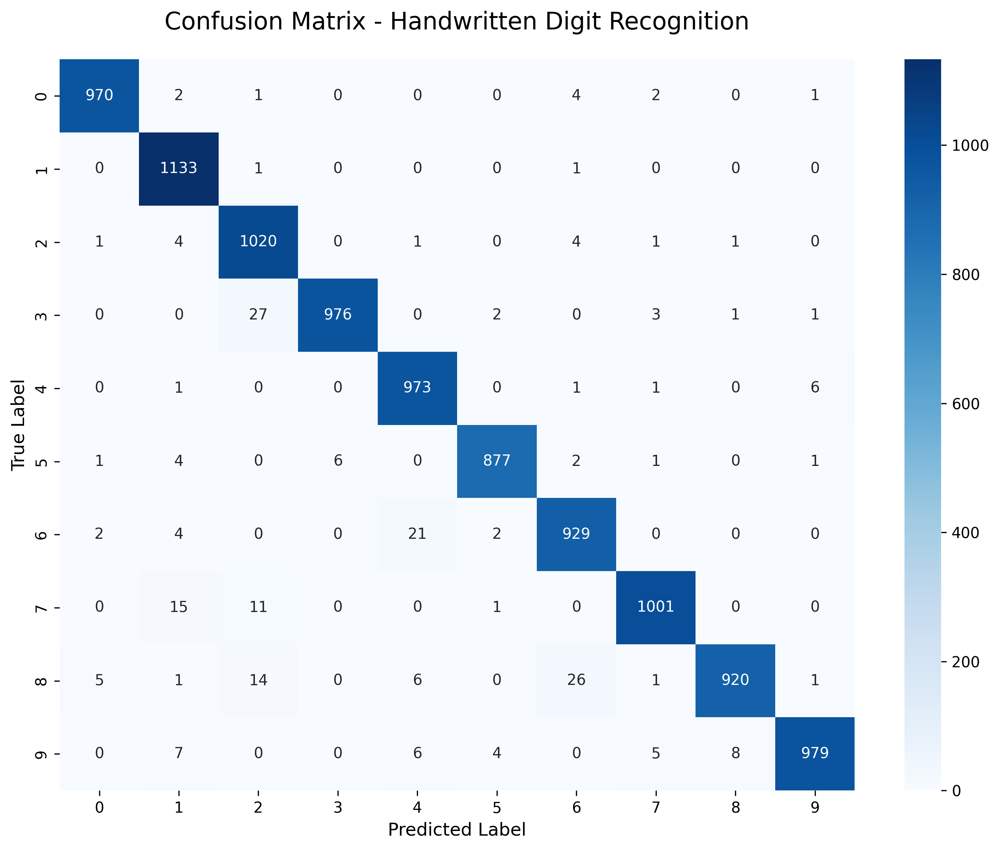
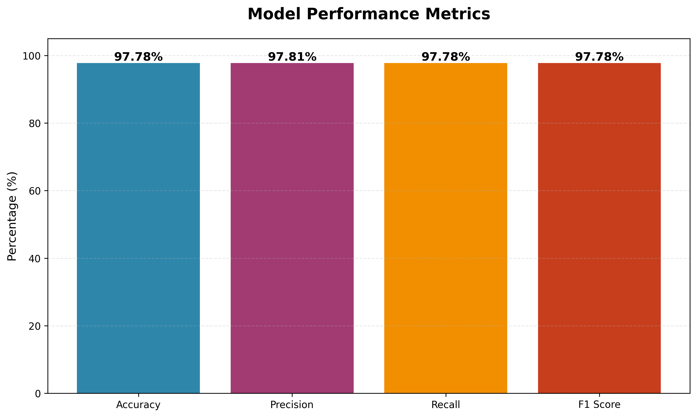
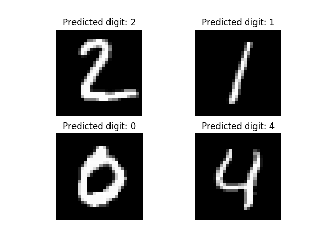

# 🔢 MNIST Handwritten Digit Recognition using OCR System

An advanced implementation of a Convolutional Neural Network (CNN) using TensorFlow/Keras for handwritten digit recognition with **97.78% accuracy** on the MNIST test dataset.

## 🎯 Model Performance Metrics

| Metric | Score |
|--------|-------|
| **Accuracy** | 97.780% |
| **Precision** | 97.814% |
| **Recall** | 97.780% |
| **F1 Score** | 97.780% |

### Per-Class Accuracy

| Digit | Accuracy | Correct/Total |
|-------|----------|---------------|
| 0 | 98.98% | 970/980 |
| 1 | 99.82% | 1133/1135 |
| 2 | 98.84% | 1020/1032 |
| 3 | 96.63% | 976/1010 |
| 4 | 99.08% | 973/982 |
| 5 | 98.32% | 877/892 |
| 6 | 96.97% | 929/958 |
| 7 | 97.37% | 1001/1028 |
| 8 | 94.46% | 920/974 |
| 9 | 97.03% | 979/1009 |

## 🚀 Live Demo

Try the live Streamlit app: [Coming soon - Deploying to Streamlit Cloud]

## ✨ Features

- 🎨 **Interactive Web Interface** - Upload and predict digits through a beautiful Streamlit UI
- 📊 **Real-time Predictions** - Instant digit recognition with confidence scores
- 📈 **Probability Distribution** - Visual representation of prediction probabilities for all digits
- 🔍 **Model Evaluation** - Comprehensive performance metrics and confusion matrix
- 💾 **Pre-trained Model** - Ready-to-use model with 97.78% accuracy

## 📊 About MNIST Dataset

The MNIST database (Modified National Institute of Standards and Technology database) contains:
- **Training set**: 60,000 examples
- **Test set**: 10,000 examples
- **Image format**: 28×28 pixel grayscale images
- **Classes**: Digits 0-9

The images are size-normalized and centered, with anti-aliasing introducing grayscale levels.

## 🏗️ Neural Network Architecture

This implementation uses a Convolutional Neural Network (CNN) with the following structure:

- **Input Layer**: 28×28 grayscale images
- **Convolutional Layers**: Feature extraction with ReLU activation
- **Pooling Layers**: Dimensionality reduction
- **Dropout Layers**: Regularization to prevent overfitting
- **Dense Layers**: Classification
- **Output Layer**: 10 neurons (one for each digit) with softmax activation


### Model Summary


## 🛠️ Installation & Usage

### Prerequisites

- Python 3.8 or higher
- pip package manager

### Quick Start

1. **Clone the repository**
```bash
git clone https://github.com/ChiragPatankar/Handwritten-Digit-Recognition-using-OCR-System.git
cd Handwritten-Digit-Recognition-using-OCR-System
```

2. **Install dependencies**
```bash
pip install -r requirements.txt
```

3. **Run the Streamlit Web App**
```bash
streamlit run app.py
```
The app will open in your browser at `http://localhost:8501`

### Alternative: Command Line Prediction

Load and test the pre-trained model without the web interface:

```bash
python load_model.py assets/images/1a.jpg
```

This will output:
```
[INFO] Loaded model from disk.
[INFO] Processing image: assets/images/1a.jpg
[INFO] Image shape after preprocessing: (1, 28, 28, 1)
Predicted Digit: 1
```

### Evaluate Model Performance

Run the evaluation script to see detailed metrics:

```bash
python evaluate_model.py
```

This generates:
- `model_metrics.txt` - Detailed performance report
- `confusion_matrix.png` - Confusion matrix visualization
- `performance_metrics.png` - Metrics bar chart

## 📁 Project Structure

```
Handwritten-Digit-Recognition-using-OCR-System/
│
├── app.py                      # Streamlit web application
├── load_model.py              # CLI tool for predictions
├── evaluate_model.py          # Model evaluation script
├── tf_cnn.py                  # Model training script
├── tf-cnn-model.h5            # Pre-trained model weights
├── requirements.txt           # Python dependencies
│
├── assets/
│   ├── images/                # Sample test images (0a.jpg - 9e.jpg)
│   └── model/
│       └── model_summary.png  # Model architecture diagram
│
├── confusion_matrix.png       # Generated confusion matrix
├── performance_metrics.png    # Generated metrics visualization
└── model_metrics.txt          # Generated detailed metrics report
```

## 🎨 Web Application Features

The Streamlit web app (`app.py`) provides:

1. **Image Upload**: Drag & drop or browse for images (JPG, PNG, BMP)
2. **Preprocessing Preview**: See the grayscale 28×28 processed image
3. **Prediction Display**: Large, clear digit prediction with confidence percentage
4. **Probability Chart**: Interactive bar chart showing probabilities for all digits
5. **Detailed Analysis**: Expandable section with exact percentages

## 📝 Sample Test Images

The `assets/images/` folder contains 50 sample images:
- 5 variations of each digit (0-9)
- Files named as `[digit][variant].jpg` (e.g., `0a.jpg`, `1b.jpg`)

## 🧪 Training Your Own Model

To train a new model from scratch:

```bash
python tf_cnn.py
```

This will:
1. Load the MNIST dataset
2. Build the CNN architecture
3. Train the model
4. Save the trained model as `tf-cnn-model.h5`
5. Display training metrics and visualizations

## 📊 Results

### Confusion Matrix


### Performance Metrics


### Sample Prediction


## 🤝 Contributing

Contributions are welcome! Please feel free to submit a Pull Request.

## 📄 License

This project is licensed under the MIT License - see the [LICENSE](LICENSE) file for details.

## 🙏 Acknowledgments

- MNIST Dataset: Yann LeCun, Corinna Cortes, and Christopher J.C. Burges
- Original implementation inspiration from various deep learning tutorials
- Built with TensorFlow, Keras, and Streamlit

## 📧 Contact

For questions or feedback, please open an issue on GitHub.

---

**Made with ❤️ by Chirag Patankar**
